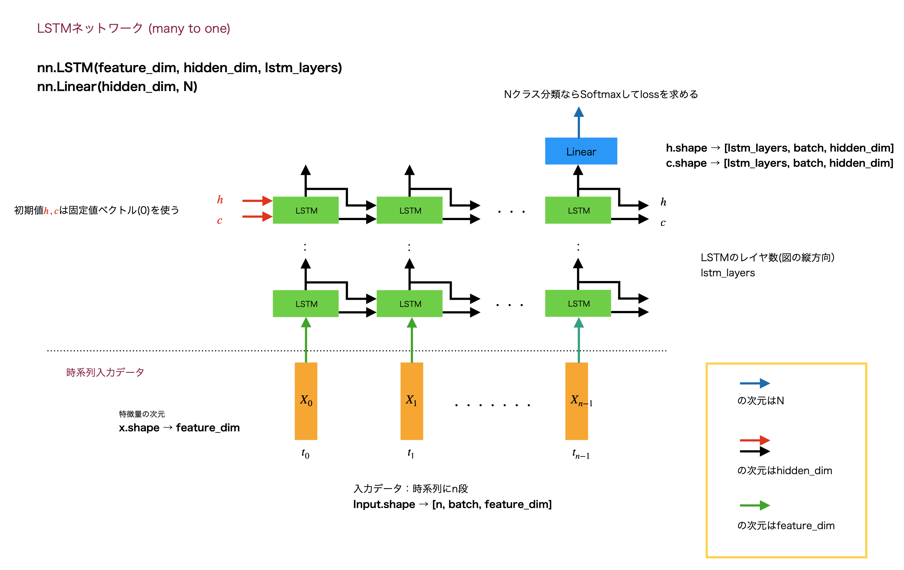

# PyTorch MNIST LSTM

MNIST を LSTM で学習・推論します。

ラインセンサーのスキャンラインをイメージしましょう。
手書き数字(MNIST)のx軸1ライン28画素を時刻 t0 〜 t27 でラインスキャンする時系列データとして扱います。

PyTorch の LSTM (many to one) 関数は図のようになっています。

MINISTに適用すると、n = 28, N = 10 で、ハイパーパラメータとして hidden_dim = 128, lstm_layers = 2 を
使用したコードになっています。

## Reference

- [Basic MNIST Exsample](https://github.com/pytorch/examples/tree/main/mnist)
- [今度こそわかるぞRNN, LSTM編](https://qiita.com/kazukiii/items/df809d6cd5d7d1f57be3)
- [【PyTorch】MNISTの分類問題をいろんなモデルで実装する【全結合層・CNN・RNN・LSTM】](https://lotti.info/mnist-dence-cnn-rnn-lstm/)
